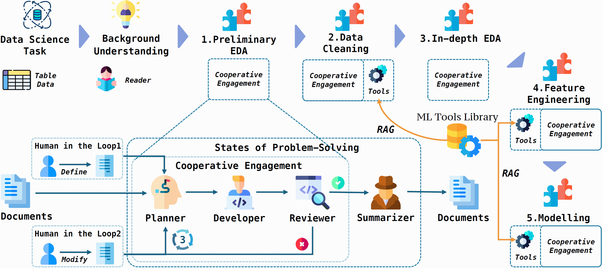

# AutoKaggle

This is the formal repo for paper: "AutoKaggle: A Multi-Agent Framework for Autonomous Data Science Competitions"

<p align="center">
    <a href="https://codeeditorbench.github.io"></a>
    <a href="https://arxiv.org/pdf/2404.03543.pdf"></a>
    <a href="https://github.com/CodeEditorBench/CodeEditorBench/blob/main/LICENSE"></a>
</p>



## Introduction

AutoKaggle is a powerful framework that assists data scientists in completing data science pipelines through a collaborative multi-agent system. The framework combines iterative development, comprehensive testing, and a machine learning tools library to automate Kaggle competitions while maintaining high customizability. The key features of AutoKaggle include:

- **Multi-agent Collaboration**: Five specialized agents (`Reader`, `Planner`, `Developer`, `Reviewer`, and `Summarizer`) work together through six key competition phases.
- **Iterative Development and Unit Testing**: Robust code verification through debugging and comprehensive unit testing.
- **ML Tools Library**: Validated functions for data cleaning, feature engineering, and modeling.
- **Comprehensive Reporting**: Detailed documentation of workflow and decision-making processes.


## Quick Start with AutoKaggle

### Set Environment

- Entering the workspace: `git clone https://github.com/multimodal-art-projection/AutoKaggle.git`

- Create a new conda environment: `conda create -n AutoKaggle python=3.11`

- Install requirements.txt: `pip install -r requirements.txt`

- Set OpenAI API key in api_key.txt
  - The first line is your api key: `sk-xxx`
  - The second line is the base url, for example: `https://api.openai.com/v1`


### Data

请把竞赛数据放置在`./multi_agents/competition`中，我们支持Kaggle中的Tabular类型数据集的评估，请确保文件夹中有以下文件：

- train.csv, test,csv, sample_submission.csv, overview.txt
  - overview.txt：把Kaggle竞赛主页的Overview和Data部分复制粘贴到该文件中，`Reader`会读取该文件总结相关信息。


### Running AutoKaggle

To run AutoKaggle experiments, use the following command:

```bash
bash run_multi_agent.sh
```

This script automates the process of running experiments for multiple competitions. Here's the explanation of what the script does and its parameters:

#### Script Parameters:

- `competitions`: An array of Kaggle competition names to run experiments on.
- `start_run` and `end_run`: Define the range of experiment runs (default: 1 to 5).
- `dest_dir_param`: Destination directory parameter (default: "all_tools").
- `model`: Specifies the AI model to be used (default: "gpt_4o"). 
  - This parameter determines the base model for the `Planner` agent
  - By default, we utilize gpt-4o for the `Developer` agent, and gpt-4o-mini for the `Reader`, `Reviewer`, and `Summarizer` agents. 
  - To customize the model selection for each agent, you can modify the `_create_agent` function in `multi_agents/sop.py`.

#### Script Behavior:

1. For each competition in the `competitions` array:
   - Runs experiments from `start_run` to `end_run`.
   - Executes `framework.py` with the current competition and model.
   - Moves result files to a structured directory in `multi_agents/experiments_history/`.

2. The results are organized as follows:
   `multi_agents/experiments_history/<competition>/<model>/<dest_dir_param>/<run_number>/`

3. Original dataset files (overview.txt, sample_submission.csv, test.csv, train.csv, data_description.txt) are kept in the competition directory.


## Result

We selected 8 Kaggle competitions to simulate data processing workflows in real-world application scenarios. 
Evaluation results demonstrate that AutoKaggle achieves a validation submission rate of 0.85 and a comprehensive score of 0.82 in typical data science pipelines, fully proving its effectiveness and practicality in handling complex data science tasks.


## Cite
